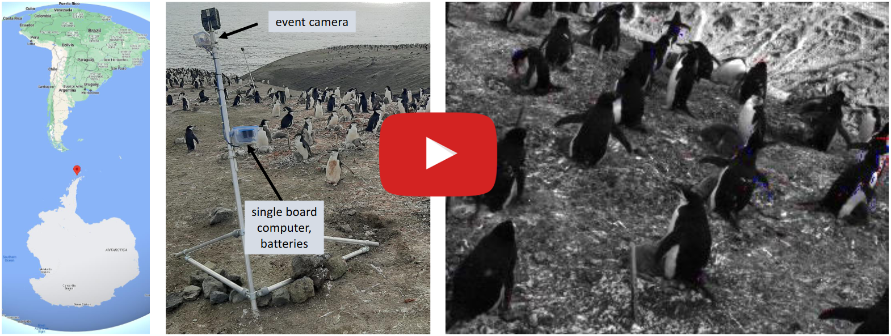

# Event Penguins (CVPR 2024)

This is the official repository for **Low-power, Continuous Remote Behavioral Localization with Event Cameras** accepted at **CVPR 2024** by [Friedhelm Hamann](https://friedhelmhamann.github.io/), [Suman Ghosh](https://scholar.google.com/citations?user=4QgBeWAAAAAJ&hl=de&oi=sra), [Ignacio Juarez Martinez](https://www.biology.ox.ac.uk/people/ignacio-nacho-juarez-martinez), [Tom Hart](https://scholar.google.co.uk/citations?user=HxUEZy0AAAAJ&hl=en), [Alex Kacelnik](https://users.ox.ac.uk/~kgroup/people/alexkacelnik.shtml), [Guillermo Gallego](https://sites.google.com/view/guillermogallego)

<h2 align="left">

 [Project Page](https://tub-rip.github.io/eventpenguins/) | [Paper](https://arxiv.org/pdf/2312.03799.pdf) | [Video](https://www.youtube.com/watch?v=o79wbZh0gU4&feature=youtu.be) | [Data](https://drive.google.com/drive/folders/1VoKEg6CSITmPH27R19tGzyzbUIrmhRDV?usp=drive_link)

</h2>

[](https://youtu.be/o79wbZh0gU4)

## Citation

If you use this work in your research, please consider citing:

```bibtex
@InProceedings{Hamann24cvpr,
    author    = {Hamann, Friedhelm and Ghosh, Suman and Martinez, Ignacio Juarez and Hart, Tom and Kacelnik, Alex and Gallego, Guillermo},
    title     = {Low-power Continuous Remote Behavioral Localization with Event Cameras},
    booktitle = {Proceedings of the IEEE/CVF Conference on Computer Vision and Pattern Recognition (CVPR)},
    month     = {June},
    year      = {2024},
    pages     = {18612-18621}
}
```

## Quickstart

### Setup

You can use [Miniconda](https://docs.conda.io/en/latest/miniconda.html) to set up an environment:

    conda create --name eventpenguins python=3.8
    conda activate eventpenguins

Install PyTorch by choosing a command that matches your CUDA version. You can find the compatible commands on the [PyTorch official website](https://pytorch.org/get-started/locally/) (tested with PyTorch 2.2.2), e.g.:

    conda install pytorch torchvision pytorch-cuda=12.1 -c pytorch -c nvidia

Install other required packages:

    pip install -r requirements.txt

### Preprocessing the data

Create a folder for the data

    cd <project-root>
    mkdir data

[Download the data](https://drive.google.com/drive/folders/1VoKEg6CSITmPH27R19tGzyzbUIrmhRDV?usp=drive_link) and save it in `<project-root>/data` create the pre-processed dataset with the following command:

    python scripts/preprocess.py --data_root data/EventPenguins --output_dir data --recording_info_path config/annotations/recording_info.csv

This crops the events according to the pre-annotated nests and stores the recordings according to the split specified in [the paper](https://arxiv.org/pdf/2312.03799.pdf).

### Inference

Create a folder models (`mkdir models`), download the pre-trained model weights from [here](https://drive.google.com/drive/folders/1A4JB97u4879oQ88FsgXa_LAU42ffpW1K?usp=sharing) and save them in the model folder.
Now you can run inference with the following command:

    python scripts/inference.py --config config/exp/inference.yaml --verbose

## Details

### Original Data

The [EventPenguins dataset](https://drive.google.com/drive/folders/1VoKEg6CSITmPH27R19tGzyzbUIrmhRDV?usp=drive_link) contains 24 ten-minute recordings, with 16 annotated nests.
An overview of the data can be found in `config/annotations/recording_info.csv`.
Each recording has a roi_group_id, which links to the location of the 16 pre-annotated regions of interest, which can be found in `config/annotations/rois` (new set of ROI's when camera was moved).
The dataset is structured as followed:

```shell
|── EventPenguins
│   ├── <yy-mm-dd>_<hh-mm-ss> # (those folders are referred to as "recordings")
│              ├── frames/
│                  ├── 000000000000.png
│                  └── 000000000001.png
│                    ...
│              ├── events.h5
│              ├── frame_timestamps.txt  # [us]
│              └── metadata.yaml       
│              ...
```

Please note that we do not use the grayscale frames in our method but provide them for completeness.

### Pre-processed Data

#### Structure

The processed data is stored in a single HDF5 file named `preprocessed.h5`. The file structure is organized as follows:

- Each ten minute recording is stored in a group labeled by its timestamp (e.g., `22-01-12_17-26-00`).
- Each group (timestamp) contains multiple subgroups, each corresponding to a specific ROI (nest) identified by an ID (e.g., `N01`).
- Each ROI subgroup contains:
  - An `events` dataset, where each event is represented as a row `[x, y, t, p]` indicating the event's x-position, y-position, timestamp (us), and polarity, respectively.
  - Attributes `height` and `width` indicating the dimensions of the ROI.

#### Attributes

Each subgroup (ROI) has the following attributes:
- `height`: The height of the ROI in pixels.
- `width`: The width of the ROI in pixels.

Each main group (recording timestamp) has the following attribute:
- `split`: Indicates the data split (e.g., `train`, `test`, `validate`) that the recording belongs to.

### Annotations

The annotations are in `config/annotations/annotations.json`.
The structure is very similar to [ActivityNet](https://github.com/activitynet/ActivityNet), with an additional layer to consider different nests.

```json
{
  "version": "VERSION 0.0",
  "database": {
    "<yy-mm-dd>_<hh-mm-ss>": {
      "annotations": {
        "<roi_id>": [
          {
            "label": <label>,
            "segment": [
              <t_start>
              <t_end>
            ]
          },
          ...
```
* `<yy-mm-dd>_<hh-mm-ss>` is the identifier for a ten-minute recording
* `roi_id` is an integer number encoding the nest
* `t_start` and `t_end` is the start and end of an action in seconds 
* the label is one of `["ed", "adult_flap", "chick_flap"]`.

`"adult_flap"` and `"chick_flap"` are other types of wing flapping easily confused with the ecstatic display (`ed`).
We provide the labels for completeness but they are not considered in our method.

## Acknowledgements

The evaluation for activity detection is largely inspired by [ActivityNet](https://github.com/activitynet/ActivityNet). We thank the authors for their excellent work.

## In the Press

* [TU Berlin Press Release](https://www.tu.berlin/ueber-die-tu-berlin/profil/pressemitteilungen-nachrichten/pinguine-in-ekstase)
* [Tagesspiegel Article (German)](https://www.tagesspiegel.de/wissen/tierbeobachtung-in-der-antarktis-das-ratsel-der-ekstatischen-pinguine-11967704.html)

## Additional Resources

* [Recording Software (CoCapture)](https://github.com/tub-rip/CoCapture)
* [Stereo Co-capture System for Recording and Tracking Fish with Frame-and Event Cameras](https://arxiv.org/pdf/2207.07332.pdf)
* [Homepage (TU Berlin, RIP lab)](https://sites.google.com/view/guillermogallego/research/event-based-vision)
* [Homepage (Science Of Intelligence)](https://www.scienceofintelligence.de/)
* [Class at TU Berlin](https://sites.google.com/view/guillermogallego/teaching/event-based-robot-vision)
* [Survey paper](http://rpg.ifi.uzh.ch/docs/EventVisionSurvey.pdf)
* [List of Resources](https://github.com/uzh-rpg/event-based_vision_resources)